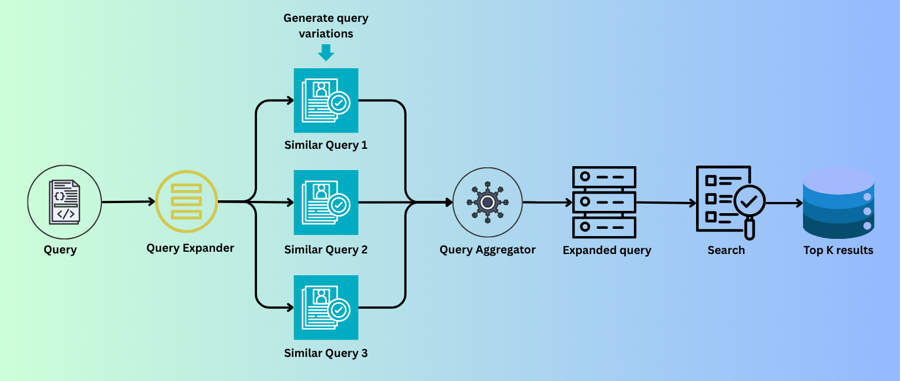

# BM25 Query Expansion Evaluation




A practical evaluation of query expansion techniques for improving BM25 retrieval performance using real-world metrics like Precision@5, Recall@5, and MRR.

---

## Overview

This project explores how query expansion can enhance lexical retrieval systems like BM25.

We compare different query expansion approaches and measure their impact on retrieval performance using standard information retrieval metrics.

---

## Objective

The goal is to evaluate whether expanding user queries leads to better retrieval quality in a BM25-based system.

---

## Techniques Implemented

- **Baseline BM25 (no expansion)**
- **Dictionary-Based Expansion (rule-based)**
- **LLM-Based Expansion (Gemini / prompt-based)**

---

## Evaluation Metrics

We use standard IR metrics:

- **Precision@5**
- **Recall@5**
- **MRR (Mean Reciprocal Rank)**

---

## Results Summary

| Method                     | Precision@5 | Recall@5 | MRR   |
|--------------------------|------------|----------|-------|
| Baseline BM25            | 0.168      | 0.4683   | 0.4885|
| Dictionary Expansion     | 0.1780     | 0.4967   | 0.5042|
| LLM-Based Expansion      | 0.2020     | 0.5567   | 0.5685|

### Key Insight

Query expansion significantly improves **recall and ranking quality**.  
LLM-based expansion provides the largest gains, especially for recall.

---

## Key Takeaways

- Query expansion improves coverage → higher recall  
- LLM-based expansion captures semantic meaning → better performance  
- Trade-off: higher accuracy vs increased latency and cost  

---


---

## How to Run

1. Clone the repository:
```bash
git clone https://github.com/your-username/bm25-query-expansion-evaluation.git
cd bm25-query-expansion-evaluation

```

### Install dependencies (if needed):

pip install -r requirements.txt

### Open the notebook:

jupyter notebook query_expansion_exp.ipynb

### Requirements

- Python 3.x
- Jupyter Notebook
- BM25 implementation (e.g., rank_bm25)
- Optional: LLM API (Gemini / OpenAI)

### Article

Read the full explanation here:
[https://veerkhot.com/articles/query_expansion.html]

### Connect

LinkedIn: [https://www.linkedin.com/in/veer-khot-93177bab/]

If you found this useful

Give the repo a and share!
